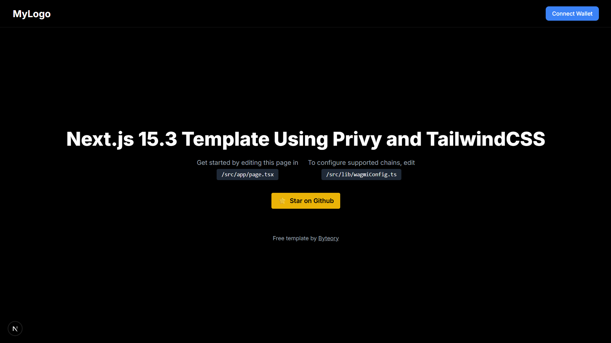

# 🛡️ Next.js 15.3 + Privy Web3 Starter Template

A sleek starter template built with **Next.js 15.3**, **Privy** (for wallet & social login), **Wagmi**, **Tailwind CSS**, and **TypeScript** — ideal for modern Web3 dApps.

> 🔥 Perfect for wallet connection, social login, EVM chain support, and rapid UI customization.

## 🖼️ Preview



---

## 🚀 Tech Stack

- **Next.js 15.3 (App Router)** - Latest Next.js with App Router
- **Privy** – Web3 authentication (wallet + social login)
- **Wagmi + Viem** – Web3 hooks and utilities
- **Tailwind CSS** – Utility-first styling
- **TypeScript** – For type safety

---

## 📂 File Structure

```
src/
├─ app/ → App Router structure
│  └─ page.tsx → Main UI page
├─ lib/
│  ├─ privy.ts → Privy configuration
│  └─ wagmiConfig.ts → Chain configuration
├─ components/ → UI components
│  └─ ConnectButton.tsx → Privy connect button
├─ providers/ → React context providers
│  └─ PrivyProvider.tsx → Privy provider setup
```

---

## 🔧 Configuration

### Environment Variables

Create a `.env.local` file in the root directory with the following:

```env
# Get your Privy App ID from https://console.privy.io
NEXT_PUBLIC_PRIVY_APP_ID=your-privy-app-id-here
```

### Privy Setup & Verification

1. Create an account at [Privy Console](https://console.privy.io)
2. Create a new project and get your App ID
3. Add your App ID to `.env.local`
4. Configure your project in Privy Console:
   - Add your domain to allowed origins
   - Configure OAuth providers (Google, Twitter, etc.)
   - Set up wallet connection preferences

### Supported Chains

The template supports Ethereum mainnet by default:

```ts
// src/lib/wagmiConfig.ts
import { mainnet } from 'viem/chains';
import { http } from 'wagmi';
import { createConfig } from '@privy-io/wagmi';

export const wagmiConfig = createConfig({
  chains: [mainnet],
  transports: {
    [mainnet.id]: http(),
  },
});
```

To add more chains, import them from 'viem/chains' and add them to the chains array.

### Login Methods

The template includes various login methods configured in `src/lib/privy.ts`:

- Email
- SMS
- Social (Google, Twitter, Discord, etc.)
- Wallet connection

---

## 💡 Features

- Wallet & social login via Privy
- Dark mode by default
- Clean, modern UI with Tailwind CSS
- Type-safe development with TypeScript
- Easy chain configuration
- Responsive design

---

## 📦 Getting Started

```bash
# Install dependencies
npm install
# or
yarn install

# Start development server
npm run dev
# or
yarn dev
```

Open [http://localhost:3000](http://localhost:3000) to view your app.

---

## 🔍 Customization

To start customizing:

1. Edit `/src/app/page.tsx` for main UI
2. Modify `/src/lib/privy.ts` for Privy configuration
3. Update `/src/lib/wagmiConfig.ts` for chain support
4. Add new components in `/src/components/`

---

## ⭐ Credits

Free template by [Byteory](https://byteory.com)

Don't forget to 🌟 the repo if you found it useful!

---

## 📜 License

MIT — free to use and modify. 